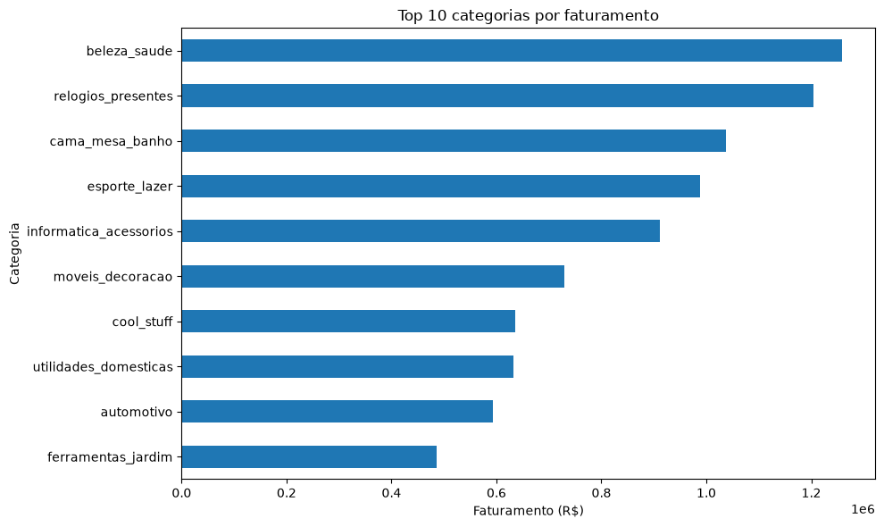
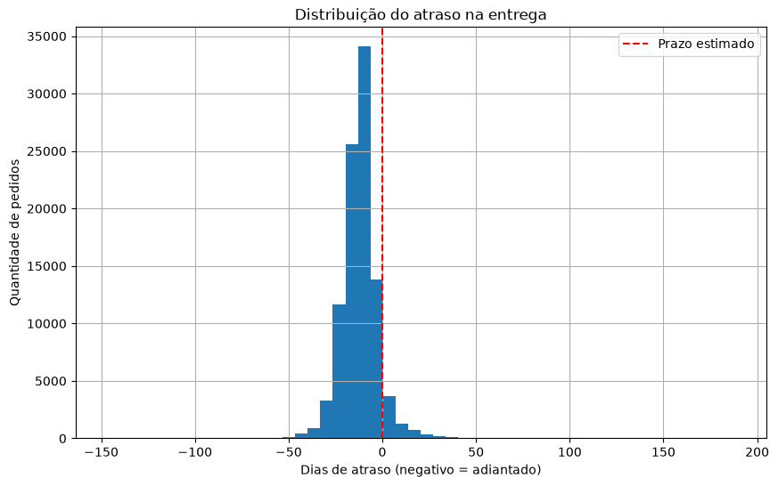
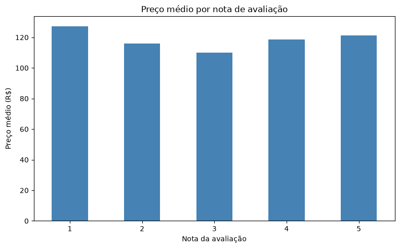
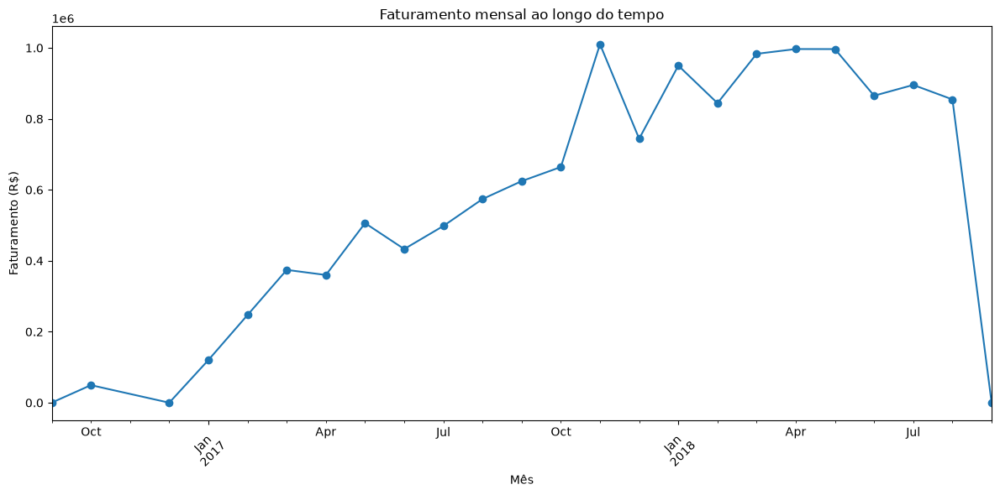

# Análise de Vendas — E-commerce (Olist)

Análise exploratória de dados de vendas de um marketplace brasileiro, usando Python (pandas, matplotlib).

## Tecnologias


## Como rodar

```bash
pip install -r requirements.txt
jupyter notebook notebooks/analise.ipynb
```

## Dados

Dataset público: [Brazilian E-Commerce (Olist)](https://www.kaggle.com/datasets/olistbr/brazilian-ecommerce)

## Perguntas respondidas

**1. Quais categorias mais faturam?**
Beleza/saúde, relógios/presentes e cama/mesa/banho lideram em faturamento.



**2. Os pedidos chegam no prazo?**
A maioria chega bem antes do estimado (mediana de -12 dias), mas há casos extremos de atraso.



**3. Preço influencia a nota de avaliação?**
Não há relação forte — o preço médio é parecido entre todas as notas.



**4. Como as vendas variam ao longo do tempo?**
Crescimento consistente em 2017, com pico em novembro (Black Friday).


